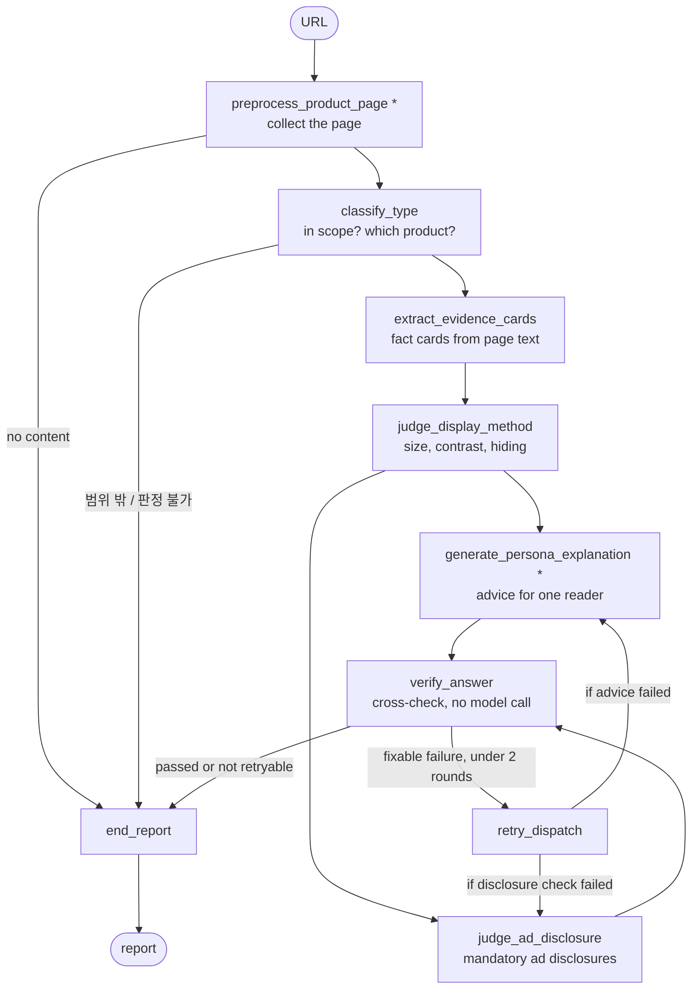

# Financial Disclosure Review

Financial Disclosure Review checks a Korean card-company advertising page against the mandatory ad disclosures and display-method rules, and writes a report for a human reviewer.

It does not give a legal opinion or publish anything automatically. Every uncertain item becomes a task for the reviewer, never a pass.

## How a review runs

One review is one run of a fixed [LangGraph](https://langchain-ai.github.io/langgraph/) graph. The order, routing, retries and verdict rules are code; only the two starred steps are tool-calling agents, and each has a turn budget.



`*` bounded tool-calling agent. The advice and the disclosure check run in parallel in the same step.

## Nodes

**`preprocess_product_page`** opens the URL in Chromium and collects only the product's own content. A page agent expands tabs and accordions, records what stays hidden, and saves a reusable selector rule per page family, so later visits to the same template replay without a model call. The browser tools are read-only: they cannot type, submit forms, download, or leave the site.

**`classify_type`** decides whether the page is in scope and which of five card-company credit products it describes (신용카드, 단기카드대출, 장기카드대출, 리볼빙, 할부금융·리스). It answers three staged questions, each backed by a quote that code checks against the page. An out-of-scope or uncertain result ends the review early with a report that states why.

**`extract_evidence_cards`** turns page lines into fact cards: a claim with its conditions, exceptions, numbers, and source line. Code keeps only cards whose quote is really on the page and records whether each source line was visible, revealed by a click, or hidden. The cards feed the reader advice.

**`judge_display_method`** judges the display rules (E group): whether mandatory disclosures are large enough, have enough contrast, and are not hidden. Code measures font size and contrast from the rendered page and decides those items; the model only labels which text blocks are mandatory disclosures and judges the qualitative items.

**`generate_persona_explanation`** writes one paragraph of plain-language advice (쉬운말 확인 권고) for a chosen reader. It names 2–5 explanation-duty items the ad does not explain and the reader should check in the product document before signing. A small agent picks the reader from a synthetic persona dataset when the reader is given in free text. Code rejects advice with invented numbers, verdict words, or rubric codes.

**`judge_ad_disclosure`** judges the mandatory ad disclosures (A·B·C groups, from 금소법 제22조 and the 여신협회 advertising rules) on the page. It checks each item's applicability condition before the verdict, and every 적합 must quote the page. Explanation-duty items (금소법 제19조) bind the contract-stage product document, so they are listed for the reviewer, not judged.

**`verify_answer`** cross-checks the three judging modules without a model call: quotes must be on the page, cited blocks must have been measured, and verdicts must not contradict measurements. For each failure it writes a concrete request for the next round.

**`retry_dispatch`** sends only the failed nodes that can act on the requests back for another round, at most twice. The display check is never retried, because the same measurements would produce the same answer; its failures go to a person.

**`end_report`** maps the results to a status and a publish decision without adding any judgment of its own. It writes a short markdown report for the requester: items to check, the reader advice, and the explanation-duty items to confirm in the product document.

## Prerequisites

- [uv](https://docs.astral.sh/uv/) — Python package and environment manager
- An OpenAI API key
- [Docker Desktop](https://docs.docker.com/desktop/) — only to serve the HTTP API

## Getting started

1. Copy the environment file and set `OPENAI_API_KEY` in it.

    ```bash
    # bash/zsh
    cp .env.example .env
    ```

    ```powershell
    # PowerShell
    Copy-Item .env.example .env
    ```

1. Install dependencies and the Playwright browser.

    ```bash
    uv sync --extra dev
    uv run playwright install chromium
    ```

1. Build the rubric database.

    ```bash
    uv run python -m financial_disclosure_review build-db
    ```

1. Review a page. Model calls incur cost.

    ```bash
    uv run python -m financial_disclosure_review review "https://<product-page>"
    ```

   The report is written to `data/reports/<thread>.md`.

## Commands

| Goal | Command | Notes |
|---|---|---|
| Build the rubric DB | `uv run python -m financial_disclosure_review build-db` | Offline and free. Run after changing a rubric. |
| Download the reader dataset | `uv run python -m financial_disclosure_review fetch-personas` | nvidia/Nemotron-Personas-Korea at a pinned revision, about 2 GB, sha256-checked. |
| Review a page | `uv run python -m financial_disclosure_review review "<url>"` | `--persona "<free text>"` sets the reader. |
| Resume a review | `uv run python -m financial_disclosure_review rerun --thread <id> --from-node <node>` | Branches from the saved checkpoint. |
| Evaluate | `uv run python -m financial_disclosure_review evaluate --ablation` | Replays recorded answers; free. |

`review` and `rerun` accept `--max-calls` and `--max-usd`. Both caps are checked before each model call.

> **Important:** Captured third-party pages and recorded model answers are not in this repository. `tests/fixtures/classify/`, `eval/fixtures/`, `eval/cassettes/`, `eval/results/` and `data/reference.sqlite` ship separately as `fdr-reproduction-assets-260930.zip`; unpack it at the repository root. Without it, tests that need a captured page are skipped and `evaluate` stops with `no evaluation cases`.

## Test

```bash
uv run pytest
uv run ruff check src tests
uv run pyright
```

Tests marked `use_llm` or `use_network` are excluded by default because they spend money or visit external sites.

## Serve the API

1. Set `OPENAI_API_KEY` and `FDR_API_TOKEN` in `.env`. Issue a token with:

    ```bash
    uv run python -m financial_disclosure_review.serving.token
    ```

1. Start the gateway and worker.

    ```bash
    docker compose -f docker/docker-compose.yml -f docker/docker-compose.override.yml up --build
    ```

1. Submit a review with `POST /v1/reviews` and poll the returned job URL. See [HTTP API](docs/api.md).

## Documentation

[docs/README.md](docs/README.md) indexes the setup guides, the architecture, the per-node specs, and the evaluation.

## License

Project code and documentation are MIT-licensed; see [LICENSE](LICENSE). Regulatory sources, product pages, names, and marks remain subject to their own terms; see [THIRD_PARTY_NOTICES.md](THIRD_PARTY_NOTICES.md).
